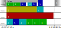

# LoopScheduler

A customizable and extensible framework for game loop architecture.

# Structure

- **[./LoopScheduler](https://github.com/LoopScheduler/LoopScheduler/tree/main/LoopScheduler):** LoopScheduler source files
- **[./Lab](https://github.com/LoopScheduler/LoopScheduler/tree/main/Lab):** Code to test C++ features
- **[./Tests](https://github.com/LoopScheduler/LoopScheduler/tree/main/Tests):** Test and evaluation code
- **[./Tests/Results](https://github.com/LoopScheduler/LoopScheduler/tree/main/Tests/Results):** Test and evaluation results
- **[./Tests/combined_test_inputs](https://github.com/LoopScheduler/LoopScheduler/tree/main/Tests/combined_test_inputs):** Some test inputs for combined_test

# Introduction

LoopScheduler is a simple framework to create desired loop architectures for games.
The main classes in this project are:

  - Loop
  - Group

The main concepts are described here, more details are available in the code documentation.

## Loop

A Loop object contains a Group as its root architecture.
This Group is used to schedule the next task.
The Loop object, runs loops in different threads that run tasks from the root Group.

## Group

Group is an abstract class.
A Group object, may contain other Groups or objects that can run tasks.
This class has the responsibility of scheduling its own members/tasks, while its Group members schedule their own members/tasks.
Simply, a Group decides what to run next.
Different types of Groups can be implemented.
There are 2 simple Groups implemented in this project:

  - ParallelGroup
  - SequentialGroup

Both of these groups can have Group members and members of Module type.

### Module

The main methods in this class are:

  - GetRunningToken(): Used by Groups to run the module.
  - OnRun(): A virtual method that has to be implemented by the derived class.
  - HandleException(...): A virtual method to handle exceptions that is optional to implement.
  - Idle(...): Used by the module itself to idle and let the other tasks run in the meanwhile.

Each Module object has 2 TimeSpanPredictor objects to predict its higher and lower timespans.
The default predictors can be replaced with other predictors using the Module's constructor.
Also, whether a Module can run in parallel (to itself) can be set using the constructor.
For example:

```
class MyModule : LoopScheduler::Module
{
    MyModule() : LoopScheduler::Module(
                    CAN_MY_MODULE_RUN_IN_PARALLEL,
                    MyHigherTimeSpanPredictor(),
                    MyLowerTimeSpanPredictor()
                )
    {...}

    virtual void OnRun() override {...}
}
```

### ParallelGroup

Runs its members in parallel.
Some specified members can run more than once per iteration while some tasks take longer to finish.

### SequentialGroup

Runs its members sequentially.
A member cannot start its tasks until the previous member finishes its jobs.
A single Group member is allowed to run its own members in parallel.

### Possibilities

Other types of groups can be implemented by the user for other purposes.
For example, a dynamic threads group that can run the threads throughout multiple loop iterations,
or other types of groups with other scheduling methods could be implemented.
For simplicity, only SequentialGroup and ParallelGroup are designed and implemented.

## An example



This figure shows a part of the execution of a loop.
The architecture (root) Group is a SequentialGroup that contains
a module shown in gray with an S letter
and a ParallelGroup containing an Idler module and 5 simple modules.
In other words:

```
SequentialGroup:
    ParallelGroup:
        Module Idler
        Module 1
        Module 2
        Module 3
        Module 4
        Module 5
    Module S
```

Idler idles for a random timespan between 10-15ms which can represent a module that waits for the GPU to complete its current task.
The 5 simple modules do work with different ranges of work amounts.
This figure is based on real data of running a Loop with the described configuration.
We can see that SequentialGroup makes use of the spare time by running other modules that take short enough time to run, from the member ParallelGroup.
Also, right before running S again, it doesn't run other worker modules to avoid risking a delay in that iteration, because 1 may finish its work sooner.
This is enabled by predicting the timespans for modules based on history.
The timespan predictor itself is extensible.
For example, general predictors that support different processor core frequencies can be implemented and used.
For simplicity, the currently used predictor isn't designed for such processors.

# Evaluation

LoopScheduler is evaluated in 2 configurations, one having a SequentialGroup and the other having a ParallelGroup as the architecture.
The ParallelGroup performance running n modules is compared to n threads calling the same function with no synchronization between them while running, and only the final joins.
The SequentialGroup performance is compared to a for loop calling the same function.
The efficiency is calculated by dividing the comparing code's execution time by LoopScheduler's time.
Figures can be generated using
[./Tests/Results/plot-evaluation-results.py](https://github.com/LoopScheduler/LoopScheduler/blob/main/Tests/Results/plot-evaluation-results.py).


The evaluation result for
[ParallelGroup in 8 threads with 80 modules vs 80 threads](https://github.com/LoopScheduler/LoopScheduler/blob/main/Tests/Results/parallel_evaluation/test-80-0.txt)
shows that the times are competitive with many modules running in parallel.
The iteration rates are close to game framerates in this particular configuration.
In other cases,
[ParallelGroup in 4 threads with 4 modules vs 4 threads](https://github.com/LoopScheduler/LoopScheduler/blob/main/Tests/Results/parallel_evaluation/test-4-slow.txt),
[ParallelGroup in 8 threads with 8 modules vs 8 threads](https://github.com/LoopScheduler/LoopScheduler/blob/main/Tests/Results/parallel_evaluation/test-8-slow.txt)
and
[SequentialGroup in 4 threads vs simple loop, both running 2 modules per iteration](https://github.com/LoopScheduler/LoopScheduler/blob/main/Tests/Results/sequential_evaluation/test-4-2.txt),
the efficiencies are below 1, mostly more than 0.99 and close to 0.995, and mostly more than 0.995 in
[ParallelGroup in 8 threads with 8 modules vs 8 threads](https://github.com/LoopScheduler/LoopScheduler/blob/main/Tests/Results/parallel_evaluation/test-8-slow.txt).

# Build

CMake can be used to build.
There are also clang++ commands at the start of the executable source files
inside [./Tests](https://github.com/LoopScheduler/LoopScheduler/tree/main/Tests)
and [./Lab](https://github.com/LoopScheduler/LoopScheduler/tree/main/Lab) directories.

## Usage

To build your own code that uses LoopScheduler with CMake,
add [add_subdirectory](https://cmake.org/cmake/help/latest/command/add_subdirectory.html)
in your CMakeLists.txt file to add LoopScheduler's root directory,
then to build your executable, after [add_executable](https://cmake.org/cmake/help/latest/command/add_executable.html),
use [target_link_libraries](https://cmake.org/cmake/help/latest/command/target_link_libraries.html)
to link your executable to LoopScheduler.
See an example of CMake linking in [./Tests/CMakeLists.txt](https://github.com/LoopScheduler/LoopScheduler/blob/main/Tests/CMakeLists.txt).

## Tests

To build the tests using CMake on Linux:

  1. Install cmake, make and a C++ compiler using the package manager.
  2. Choose/create a build folder and navigate to there in terminal.
  3. Enter `cmake <project-path> -DLOOPSCHEDULER_BUILD_TESTS=ON && make`,
     replace `<project-path>` with the project's root directory where CMakeLists.txt exists.
     The test executables will be in the Tests folder where the commands were executed.

Or simply:

  2. Navigate to the project's root folder in terminal.
  3. Enter these commands:

  ```
  mkdir Build
  cd Build
  cmake .. -DLOOPSCHEDULER_BUILD_TESTS=ON && make
  ```

To build the tests using CMake on Windows:

  1. Download and install CMake from: https://cmake.org/download/
  2. Open the project in CMake and enable the LOOPSCHEDULER_BUILD_TESTS option to build the tests.
  3. Generate the project for an IDE and use the supported IDE to build.
     Make sure to disable optimizations for evaluations and tests, because they contain dummy loops.
     This is automatically done for GNU (g++) and Clang (clang++) compilers.

# Get started

Here are some examples to get an idea of how to use LoopScheduler.

## Include

To use LoopScheduler, include: [./LoopScheduler/LoopScheduler.h](https://github.com/LoopScheduler/LoopScheduler/blob/main/LoopScheduler/LoopScheduler.h)

## Implementing a simple Module

```
class MyModule : LoopScheduler::Module
{
    virtual void OnRun() override
    {
        // Idle for about 0.1s
        Idle(0.1);
        // Do anything
    }
}
```

## Setting up a Loop with a ParallelGroup

```
void SetupAndRun()
{
    // Prepare ParallelGroup members:
    std::vector<LoopScheduler::ParallelGroupMember> parallel_members;

    // Create the first member:
    auto member1 = LoopScheduler::ParallelGroupMember(
        std::make_shared<MyModule>()
    );
    // Add to the vector:
    parallel_members.push_back(member1);

    // Prepare the second member, as one that can run more than once per iteration (with 1 run share per extra iteration):
    auto member2 = LoopScheduler::ParallelGroupMember(
        std::make_shared<MyModule>(), 1
    );
    parallel_members.push_back(member2);

    // Create the ParallelGroup:
    std::shared_ptr<LoopScheduler::ParallelGroup> parallel_group(new LoopScheduler::ParallelGroup(parallel_members));

    // Alternatively:
    auto parallel_group_alt = std::make_shared<LoopScheduler::ParallelGroup>(parallel_members);

    // Prepare the loop
    LoopScheduler::Loop loop(parallel_group);

    // Run the loop (blocks until stopped)
    loop.Run();
}
```

## Important note on smart pointers

Make sure to never use `std::shared_ptr` in 2 objects pointing at each other.
This will cause a memory leak.
It is recommended to use `std::weak_ptr` when possible, or simple pointers combined with code to handle object destruction, to access peers.

# Recommendations for game loop architecture

An ideal loop for a resource demanding game would be a ParallelGroup with modules that can run more than once and can handle the synchronization.
This way no module can be a bottleneck, this is important because different computers may have different bottlenecks.
Other loop architectures can be designed for less demanding games to make the implementation of modules easier.

It's recommended to do IO tasks like reading files in a single module that cannot run in parallel, that means in a single thread.
Doing them in multiple theads doesn't improve performance and may introduce stutters.

# Test

All the tests must be compiled with compiler optimizations off.
This is because they contain dummy loops to simulate work.
The 2 evaluate executables are used to evaluate the performance.
To test the behavior, use combined_test to run one of the 2 pre-defined tests or create and run a custom test.
combined_test offers 3 options initially:

  1. Test 1: A pre-defined test used as an example of how LoopScheduler works.
  2. Test 2: Tests whether adding 1 module to 2 groups throws an exception.
  3. Custom test: Allows to configure and run a custom defined loop.
     [./Tests/combined_test_inputs](https://github.com/LoopScheduler/LoopScheduler/tree/main/Tests/combined_test_inputs) contains some examples.

The test results are manually verified except the pre-defined test2.
Some test inputs are available in [./Tests/combined_test_inputs](https://github.com/LoopScheduler/LoopScheduler/tree/main/Tests/combined_test_inputs).
To try them, copy the lines under "Input:", run combined_test and paste them into the command-line interface.

# Contributing

Before contributing to this project, please open an issue and discuss the change you wish to make.
The code in this repository is meant to be kept as simple as possible and might be expanded in future work separately.
More complex Groups and TimeSpanPredictors are possible, but this project is not meant to include them.
